# Web Application Penetration Test - NBN Server

This was a black-box penetration test conducted on a simulated client
environment as part of university coursework. The target was a web server
and client belonging to a fictional company called NBN. The test was
conducted under the name of ASPC (our consulting team) and followed a
formal penetration testing methodology from reconnaissance through to a
full written report with CVSS 4.0 scored findings and remediation guidance.

The scope covered external network testing, web application testing, and
internal network testing if access was achieved. The client requested
findings of Medium severity or higher only.

---

## Environment

| Machine | IP Address | Network |
|---|---|---|
| NBN Server | 10.10.0.66 / 172.16.1.1 | Host-Only Adapter |
| NBN Client | 10.10.0.2 / 172.16.1.2 | Host-Only Adapter |
| Kali Linux (Attacker) | 10.10.0.3 | Host-Only Adapter |

---

## Reconnaissance

### Passive Reconnaissance

WHOIS lookups confirmed the target IPs were within private RFC1918 ranges,
meaning no public information was available. Manual browsing of the server
revealed robots.txt with two disallowed directories (/data and /internal),
a login form that leaked back-end error logic, a subscribe form vulnerable
to command injection, and developer comments in the page source revealing
the injection vulnerability.

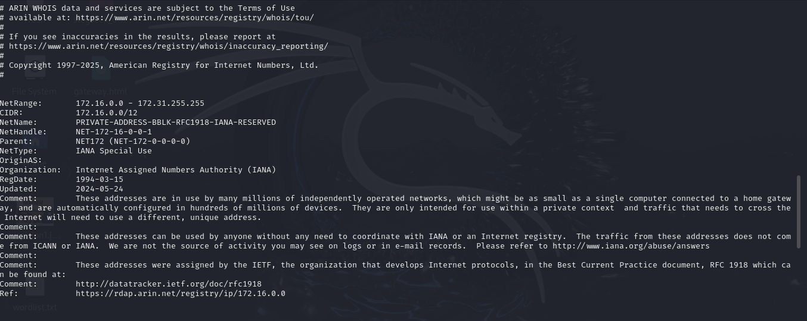

### Active Reconnaissance

**Nmap** identified four open services:

| Port | Service | Version |
|---|---|---|
| 80 | HTTP | Apache 2.4.29 |
| 443 | SSH (Yes, intentional) | OpenSSH 7.6p1 |
| 8001 | HTTP | Apache 2.4.29 |
| 9001 | FTP | vsftpd 3.0.3 (anonymous login allowed) |

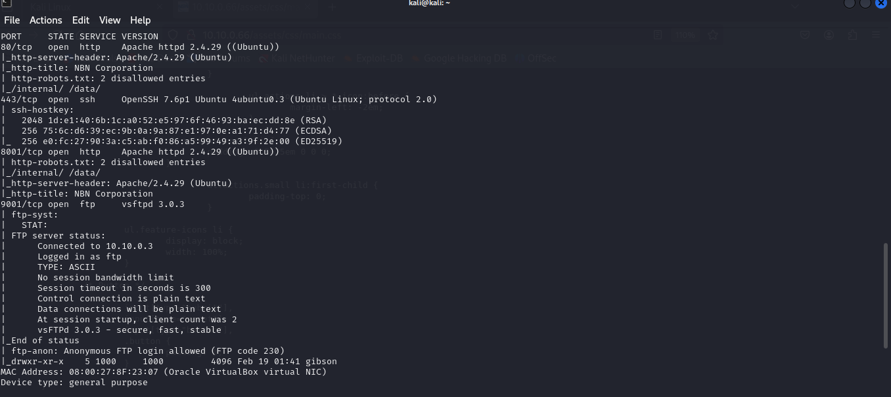

**Gobuster** revealed hidden directories including /data, /internal,
/phpinfo.php, and /php.ini among others.

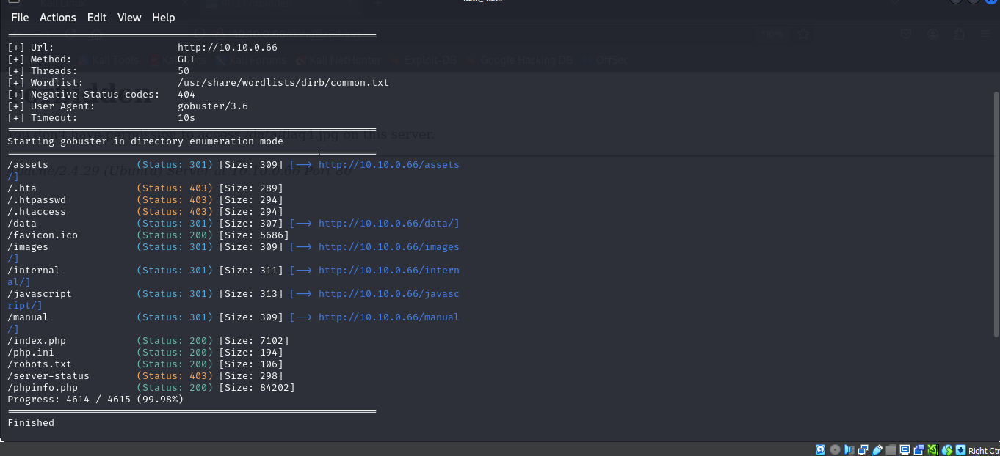

**Nikto** flagged an outdated Apache version, missing security headers
(X-Frame-Options, X-Content-Type-Options), exposed phpinfo.php, and a
login cookie missing the HttpOnly flag.

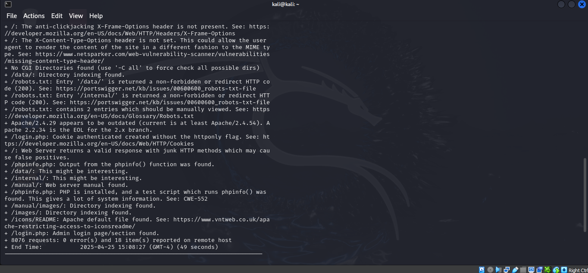

---

## Vulnerabilities Found

### Critical

**Command Injection via Shell Execution - CVSS 9.8**
A developer comment in the page source revealed the subscribe form was
vulnerable to remote command execution. Unsanitised input allowed shell
commands to be passed directly to the server without authentication.

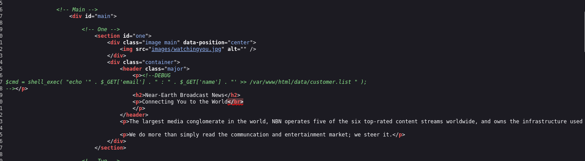

**Unrestricted Root Privileges via Sudo - CVSS 9.8**
The user gibson was found to have unrestricted sudo privileges with no
password required. Once access to the account was gained, running
`sudo su` granted full root access to the server, enabling complete
system compromise.

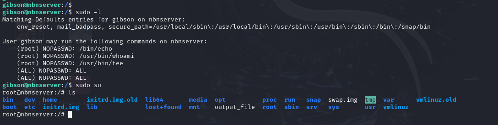

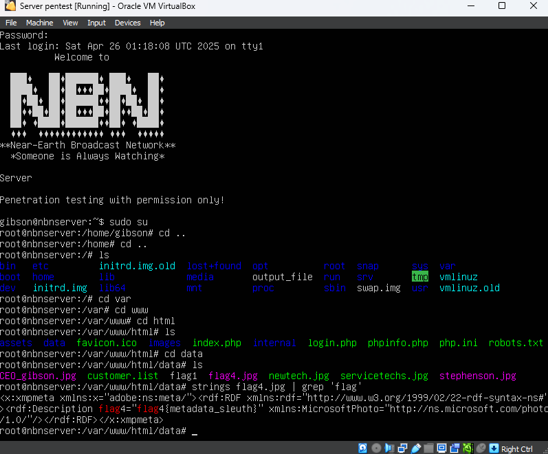

---

### High

**Anonymous FTP Access - CVSS 7.5**
Nmap confirmed FTP on port 9001 allowed anonymous login. This gave
unauthenticated access to sensitive files, flags, and forbidden directories
without any credentials. Verified again through Metasploit's auxiliary
FTP scanner.

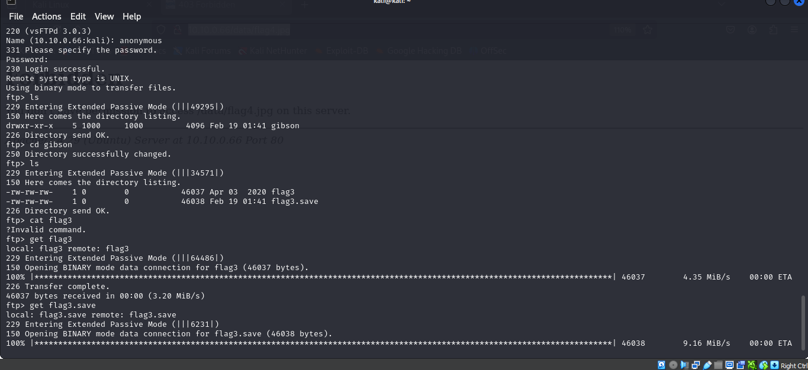

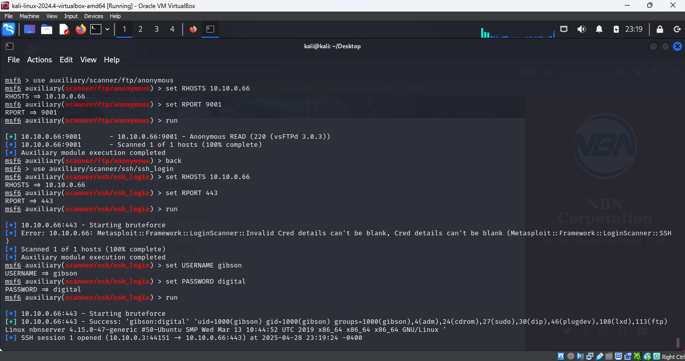

**SSH Brute Force - CVSS 7.5**
The username gibson was discovered in an image filename in the /data
directory. Hydra with the rockyou.txt wordlist successfully brute forced
the password "digital" in a short time. SSH access was then obtained
through port 443.

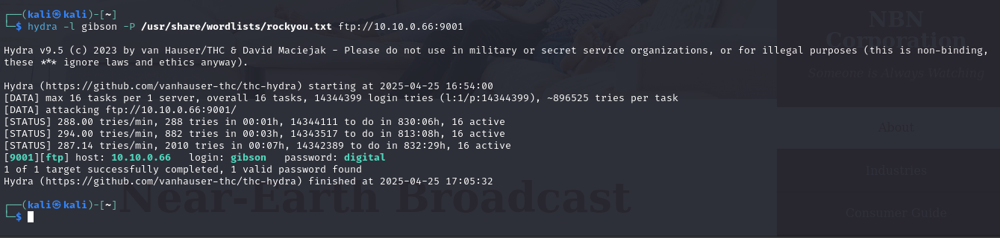

**Password Hidden in Image Metadata - CVSS 6.5**
The file CEO_gibson.jpg contained a plaintext password embedded in its
metadata. Extracted using both the `strings` command and `exiftool` which
revealed the password in the Flash Model field.

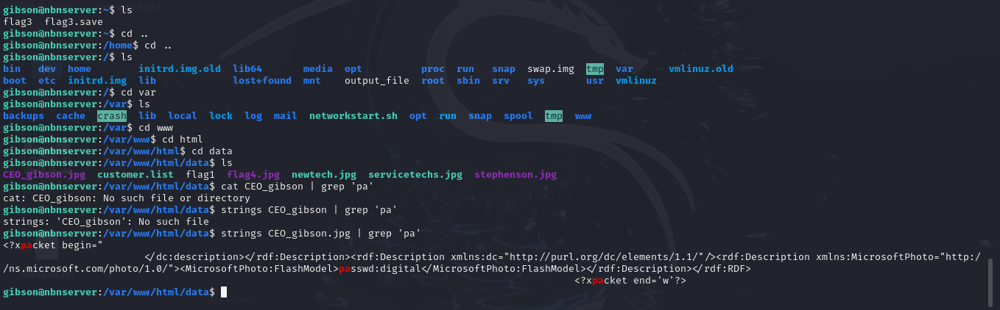

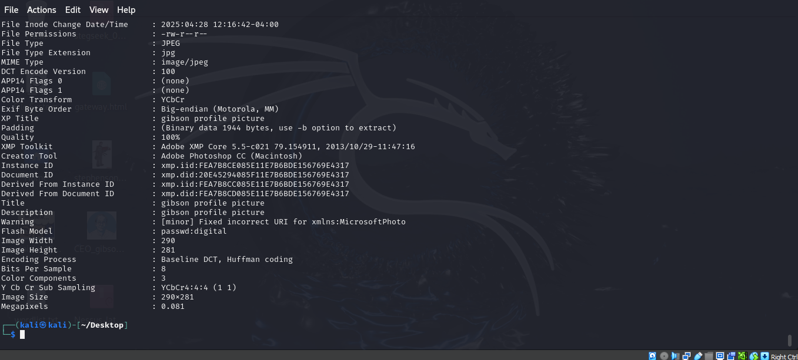

**Customer List Exposed - CVSS 7.5**
The /data directory contained a publicly accessible customers.list file
with names and email addresses of real customers, exposing personally
identifiable information.

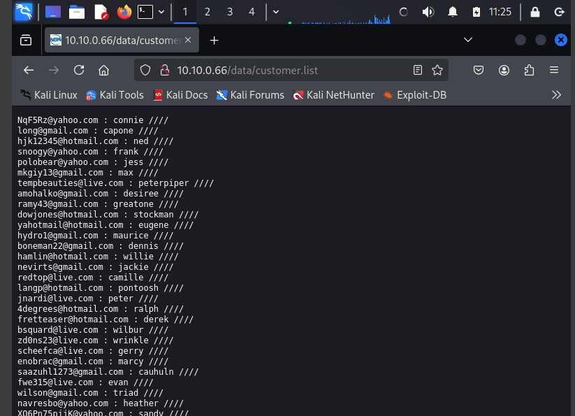

**Broken Access Control - CVSS 8.1**
Navigating to `http://10.10.0.66/internal/employee.php?name=gibson` logged
directly into gibson's account without requiring a password. Any username
could be impersonated simply by changing the URL parameter.

**Weak Authentication - CVSS 7.1**
The login page hinted that passwords could be guessed. The user stephenson
was identified through an image in /data showing a pizza delivery man.
An AI-generated wordlist based on pizza/delivery terms was used with
BurpSuite Intruder to brute force the login. The correct password
"pizzadeliver" was found when a 302 response was returned.

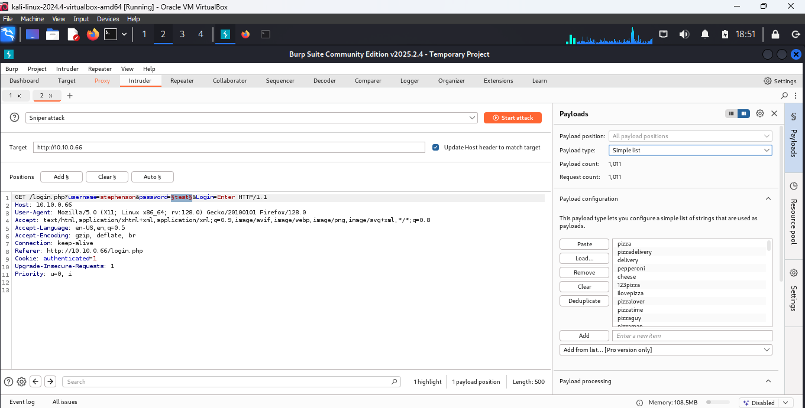

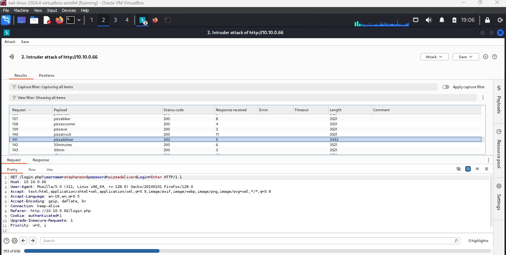

---

### Medium

**phpinfo.php Exposed - CVSS 5.3**
A publicly accessible phpinfo.php file leaked server configuration,
PHP version, file paths, and environment variables.

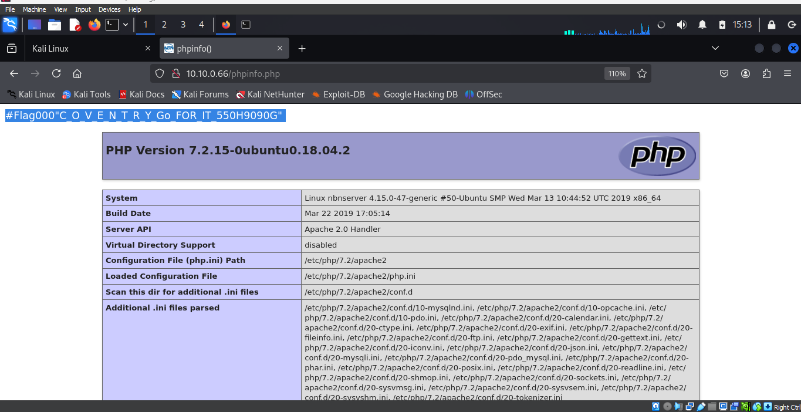

**robots.txt Discloses Sensitive Paths - CVSS 5.3**
robots.txt revealed /data and /internal as disallowed directories,
directly pointing attackers to the most sensitive parts of the server.

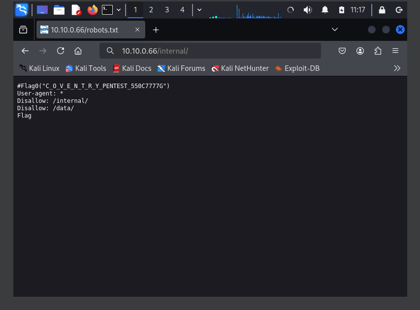

**Cross-Site Scripting - CVSS 6.1**
After logging in, the welcome message was reflected directly from a URL
parameter without sanitisation. XSS payloads executed successfully,
confirming the server was vulnerable to script injection.

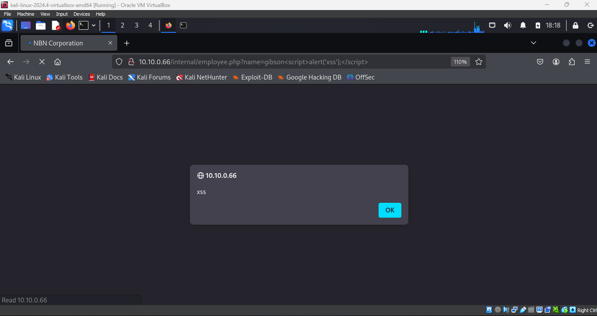

---

## Post-Exploitation

After gaining root access through gibson, the following was achieved:

- Read /etc/passwd and /etc/shadow
- Downloaded stephenson.jpg via SCP to identify the second user
- Accessed flag4.jpg which was permission-denied for normal users
- Decoded a base64-encoded flag7 hidden as a PNG file using base64.guru

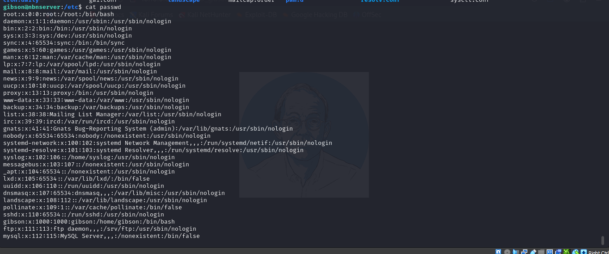

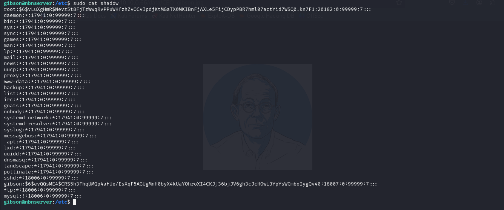

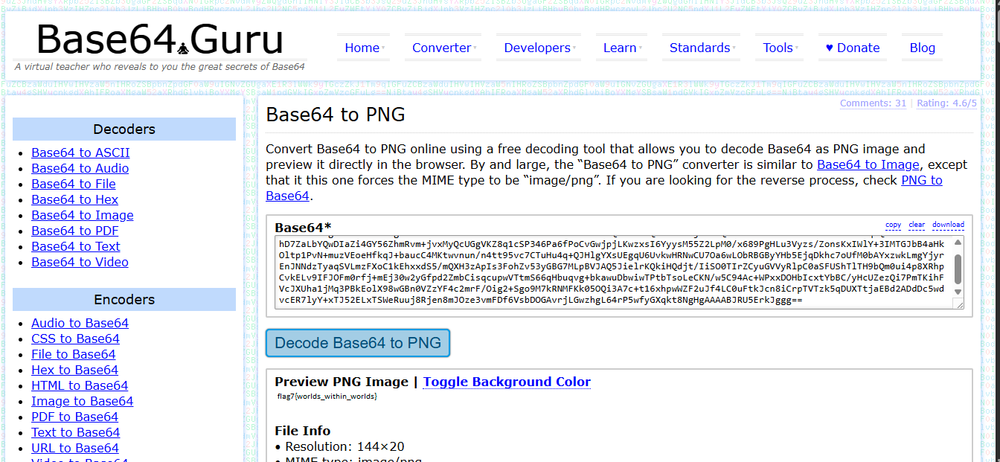

---

## Flags Captured

| Flag | Location | Method |
|---|---|---|
| Flag0 | robots.txt | Manual browsing |
| Flag00 | Page source | View source inspection |
| Flag000 | phpinfo.php | Gobuster / Nikto discovery |
| Flag1 | /data directory | Manual browsing |
| Flag2 | Future customers page | SSH login as gibson |
| Flag3 | FTP download + SSH strings | Anonymous FTP / SSH |
| Flag4 | /var/www/html/data/flag4.jpg | Root access via sudo su |
| Flag7 | stephenson account, base64 decoded | Client access + base64.guru |

---

## Tools Used

| Tool | Purpose |
|---|---|
| Nmap | Port scanning and service enumeration |
| Gobuster | Directory and file brute forcing |
| Nikto | Web server vulnerability scanning |
| WHOIS | Passive OSINT reconnaissance |
| Hydra | SSH and FTP credential brute forcing |
| Metasploit | FTP and SSH exploitation modules |
| BurpSuite | Login interception and Intruder brute force |
| curl | HTTP request simulation |
| strings / exiftool | Metadata and steganography extraction |
| Recon-ng | OSINT (non-functional in this environment) |

---

## Key Findings Summary

| Severity | Count | Examples |
|---|---|---|
| Critical | 2 | Command injection, unrestricted sudo privilege escalation |
| High | 5 | Anonymous FTP, SSH brute force, broken access control, customer data exposure, weak authentication |
| Medium | 3 | XSS, phpinfo.php, robots.txt disclosure |
| Low | 1 | Developer comments in page source |

---

## What I Learned

The most interesting discovery in this test was the Stephenson password.
There was no technical hint, just an image of a pizza delivery man and
a note on the login page saying the password could be guessed. Combining
that visual clue with an AI-generated wordlist and BurpSuite Intruder to
automate the attack showed how social engineering and technical exploitation
can work together. It is the kind of finding that gets written up in real
pen test reports.

The root privilege escalation via gibson's unrestricted sudo access was
also significant. A single weak SSH password combined with excessive
privileges gave full control of the entire server. Two vulnerabilities
that individually might seem manageable but together represent complete
system compromise.

---

## Repository Structure

```
web-application-pentest-report/
|
+-- README.md
+-- report/
|   +-- pentest-report.pdf
+-- screenshots/

```

---

*Tools: Nmap, Gobuster, Nikto, Hydra, Metasploit, BurpSuite, exiftool, strings, curl*
